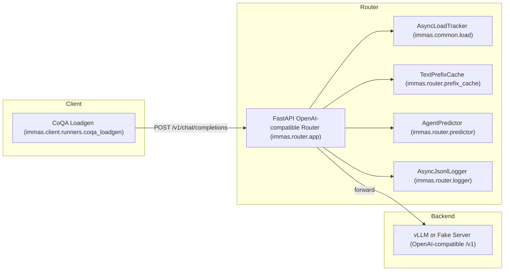
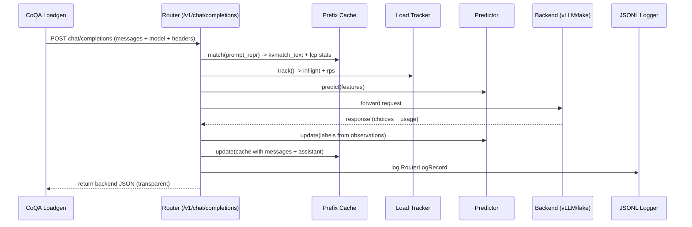

# IMMAS

**IMMAS** (Incentive Matching Mechanism for Efficient Web LLM Multi-Agent Services Routing) is a lightweight, OpenAI-compatible **router** plus a **CoQA dialogue load generator** designed to measure and learn from end-to-end behavior under multi-turn chat workloads.

Core goals:

- Generate realistic **multi-turn** traffic (dialogue-level concurrency, sequential turns).
- Run traffic through a **router** that:
  - Computes prediction-time features (load, prompt length, prefix-match cache proxy).
  - Forwards requests to an OpenAI-compatible backend (e.g., vLLM).
  - Logs per-request records to JSONL.
  - Performs **online learning** for latency/cost/performance and cache reuse calibration.
- Analyze the JSONL logs offline (analysis module not shown here).

## Architecture



## Quickstart

### 0) Installation

Requires [`uv`](https://github.com/astral-sh/uv).

1. `uv sync --all-groups`: Install dependencies and dev tools.
2. `uv run prek install`: Install git pre-commit hooks.
3. `uv run prek run -a`: Run format and check on all files.
4. `uv run ty check`: Run type check on all files.
5. (Optional): `uv ruff check --fix`: Lint. Included in `prek run`.
6. (Optional): `uv ruff format`: Format. Included in `prek run`.

### 1) Start backend (example: vLLM) on port 8000

Terminal 0: run vLLM. The router expects an OpenAI-compatible backend at:

- `http://localhost:8000/v1`

```bash
export HF_ENDPOINT=https://hf-mirror.com

export OPENAI_API_KEY=sk-local

export HF_TOKEN="hf_TO...s"

CUDA_VISIBLE_DEVICES=0 vllm serve meta-llama/Llama-3.2-3B-Instruct \
  --host 0.0.0.0 \
  --port 8000 \
  --served-model-name placeholder-model \
  --api-key "$OPENAI_API_KEY" \
  --max-model-len 4096 \
  --enable-prefix-caching \
  --enable-prompt-tokens-details \
  --dtype float16
```

> [!note]
>
> `--enable-prefix-caching` and `--enable-prompt-tokens-details` are required for returning KV cache match data (`usage.prompt_tokens_details.cached_tokens` in `/v1/chat/completions` API endpoint).

### 2) Start router on port 9000

Terminal 1:

```bash
export IMMAS_BACKEND_BASE_URL=http://localhost:8000/v1
export IMMAS_ROUTER_LOG_PATH=router_run.jsonl
uv run uvicorn immas.router.app:app --port 9000
```

### 3) Run CoQA load generator against the router

Terminal 2:

```bash
export HF_ENDPOINT=https://hf-mirror.com
export OPENAI_BASE_URL=http://localhost:9000/v1
export MODEL_NAME=placeholder-model
MAX_DIALOGUES=64 MAX_TURNS=5 MAX_CONCURRENCY=16 VERBOSE=1 uv run -m immas.client.runners.coqa_loadgen
```

### 4) Analyze the router logs

Terminal 3:

```bash
uv run -m immas.analysis.run_analyzer --log router_run.jsonl --outdir run_analysis
```

## Repository map

- `immas/client/runners/coqa_loadgen.py`: CoQA-driven async load generator
- `immas/common/load.py`: async inflight + sliding-window RPS tracker
- `immas/common/text.py`: shared text helpers (cache normalization, last-user extraction)
- `immas/data/coqa/loader.py`: CoQA dataset extraction + indexing
- `immas/openai/chat.py`: deterministic chat serialization, assistant extraction
- `immas/openai/usage.py`: robust parsing of token usage across schemas
- `immas/router/app.py`: router FastAPI app: feature extraction, forwarding, logging, online learning
- `immas/router/backend.py`: HTTP forwarder to OpenAI-compatible backend
- `immas/router/logger.py`: async JSONL logger + log record schema
- `immas/router/predictor.py`: online models (River) for latency/cost/perf + cache ratio calibrator
- `immas/router/prefix_cache.py`: per-dialogue serialized-prompt prefix cache for KV reuse proxy

## Concepts and terminology

### Dialogue and turn

- A **dialogue** is one CoQA story plus $N$ question/answer turns.
- A **turn** is 1-based: turn $1$ corresponds to $Q1/A1$, turn $2$ to $Q2/A2$, etc.

### Router “KV match” proxy

The router does not have direct access to backend KV-cache internals, but it computes a **text prefix reuse proxy**:

- It stores the last serialized prompt text per $(\text{backend}, \text{model}, \text{dialogue\_id})$.
- For a new request, it computes the **longest common prefix** length (in characters) between:
  - the cached serialized prompt text
  - the current serialized prompt text

It then defines:

$$
\text{kvmatch\_text} = \begin{cases}
\frac{\text{lcp\_chars}}{\text{prompt\_chars}}, & \text{if }\text{prompt\_chars} > 0 \\
0, & \text{otherwise}
\end{cases}
$$

This is used as a prediction-time feature.

## Environment variables (overview)

### Router (`immas.router.app`)

- `IMMAS_BACKEND_BASE_URL` (default `http://localhost:8000/v1`): backend base URL (must end with `/v1`)
- `IMMAS_BACKEND_ID` (default `b0`): backend identifier used in logs/cache keys
- `IMMAS_ROUTER_LOG_PATH` (default `router_run.jsonl`): JSONL output path
- `IMMAS_ROUTER_LOG_APPEND` (default `false`): append to log instead of overwrite

### Loadgen (`immas.client.runners.coqa_loadgen`)

- `COQA_SPLIT` (default `validation`): HF split
- `MODEL_NAME` (default `fake-coqa`): `model` field used in the OpenAI request (router forwards this)
- `OPENAI_BASE_URL` (default `http://localhost:9000/v1`): router base URL
- `OPENAI_API_KEY` (default `sk-local`): passed to OpenAI client (router may forward authorization)
- `MAX_DIALOGUES` (default `3`): number of dialogues to run
- `MAX_TURNS` (default `5`): max turns per dialogue
- `MAX_CONCURRENCY` (default `8`): max concurrent in-flight requests across dialogues
- `VERBOSE` (default `0`): print per-turn completion and errors
- `SHUFFLE_DIALOGUES` (default `0`): shuffle selected dialogues
- `SEED` (default `0`): RNG seed for shuffle
- `RUN_ID` (default derived timestamp like `coqa_YYYYMMDD_HHMMSS`): identifier propagated into router logs via headers

> [!tip]
>
> `HF_ENDPOINT` is used by the HuggingFace datasets stack (outside this code) to choose a mirror endpoint.

## Request flow



## Output artifacts

- `router_run.jsonl`: one JSON object per request with features + predictions + observations.
- `run_analysis/`: analysis outputs (depends on `immas.analysis`, not shown here).
